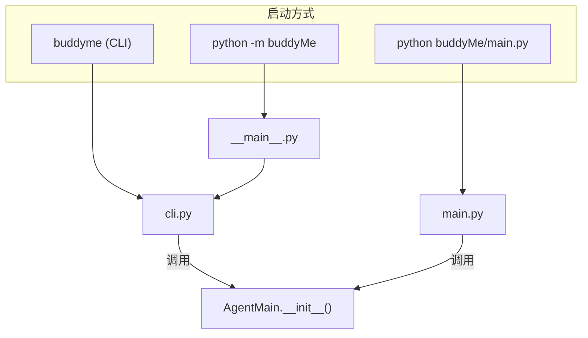
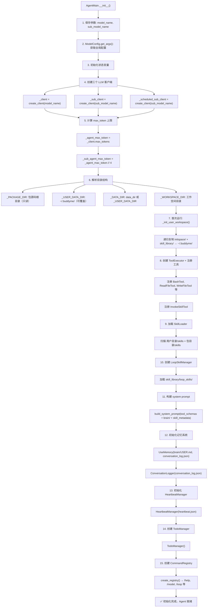
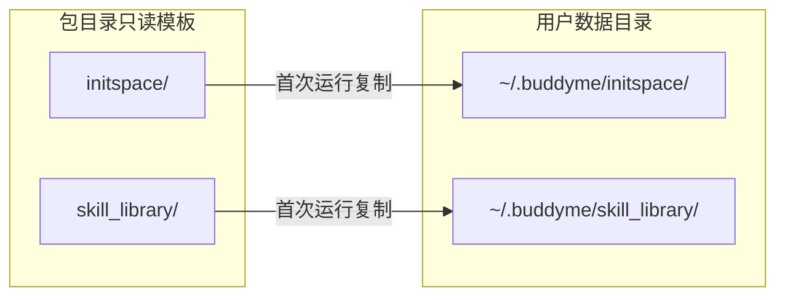
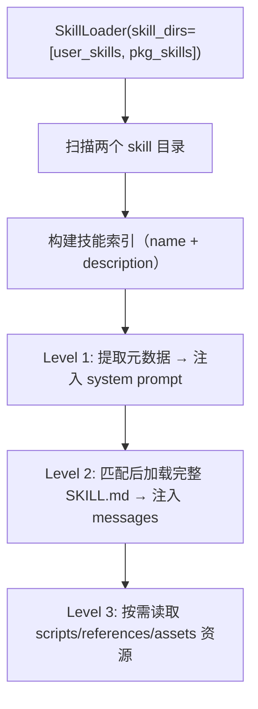
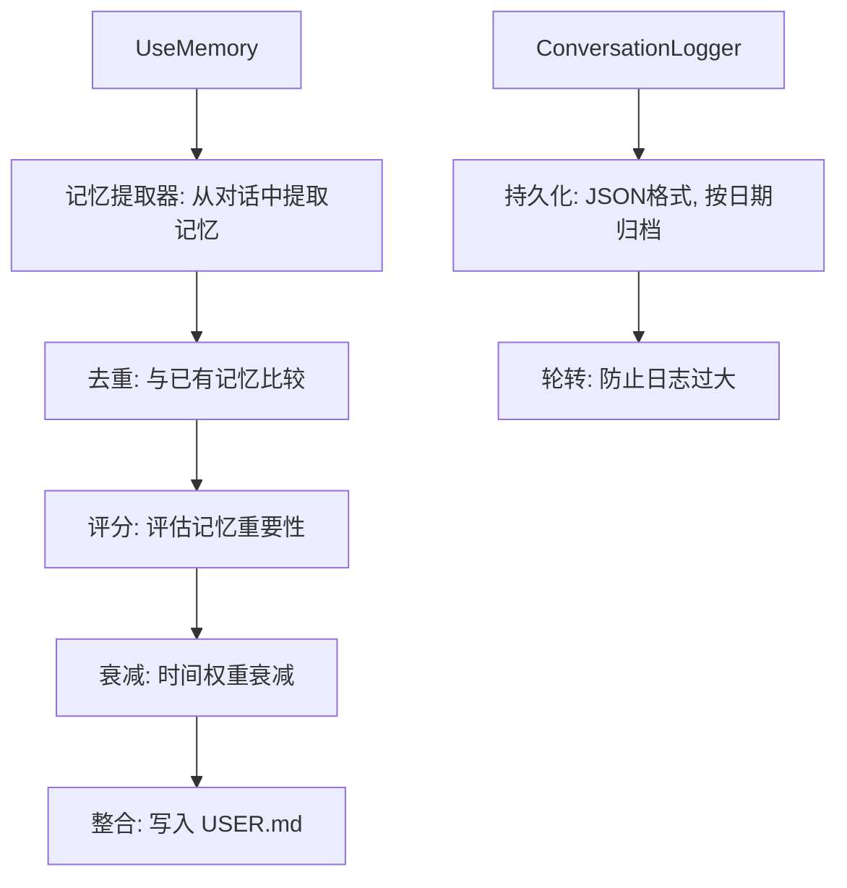
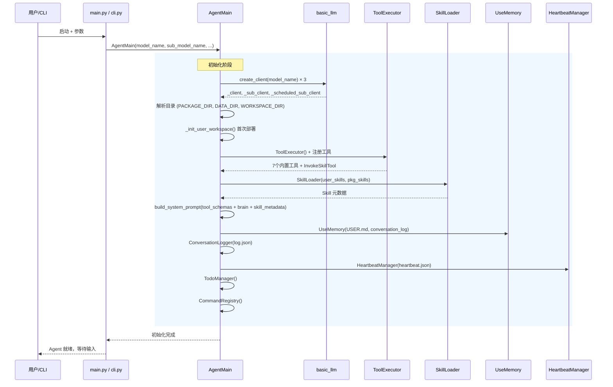

# Agent 初始化详解

本文档详细描述 buddyMe Agent 从启动到就绪的完整初始化流程，以及背后的机制。

## 一、入口文件关系



| 启动方式 | 入口文件 | 参数支持 | UI 风格 | 说明 |
|----------|----------|----------|---------|------|
| `python buddyMe/main.py` | `main.py` | `--model`, `--sub-model` | 原生 print | 本地开发模式，`data_dir` 为源码目录 |
| `python -m buddyMe` | `__main__.py` → `cli.py` | `--model`, `--sub-model` | Rich | 包安装模式，`data_dir` 为 `~/.buddyme/` |
| `buddyme` | `cli.py` | `--model`, `--sub-model` | Rich | 包安装模式（同上），只是入口命令不同 |

**关键区别**：
- `main.py` 使用原生 print 输出，`data_dir` 指向源码目录（本地开发模式）
- `cli.py` 使用 Rich UI（spinner + 彩色），`data_dir` 为 `~/.buddyme/`（生产模式）
- `__main__.py` 仅是 `cli.py` 的转发入口（3行代码）

## 二、模型名称解析

模型名称的优先级（从高到低）：

```
命令行参数 (--model/-m) > 环境变量 (BUDDYME_MODEL) > 默认值 (glm_code_plan)
命令行参数 (--sub-model/-s) > 环境变量 (BUDDYME_SUB_MODEL) > 默认值 (glm_code_plan)
```

示例：
```bash
# 通过命令行参数指定模型
python buddyMe/main.py --model deepseek --sub-model glm_code_plan

# 通过环境变量
export BUDDYME_MODEL=deepseek
export BUDDYME_SUB_MODEL=mimo
python -m buddyMe

# 默认值
python -m buddyMe  # model_name="glm_code_plan", sub_model_name="glm_code_plan"
```

## 三、AgentMain.__init__() 初始化流程



## 四、初始化步骤详解

### 步骤 1-3：参数与状态

```python
self.model_name = model_name
_args = ModelConfig.get_args()  # 全局配置（MAX_TOOLS_COMPRESS_LEN, MAX_SEARCH_CALLS 等）

self.messages = []           # 对话历史
self._used_tools = []        # 本轮使用过的工具
self._used_skills = []       # 本轮使用过的技能
self.max_steps = 11          # 主循环最大步数
self._max_heartbeat_steps = 10  # 心跳最大步数
self.max_messages_length = 20   # 对话历史最大条数
```

### 步骤 4-5：三个 LLM 客户端

| 客户端 | 变量名 | 模型 | 用途 |
|--------|--------|------|------|
| 主客户端 | `_client` | `model_name` | 主对话交互 |
| 子任务客户端 | `_sub_client` | `sub_model_name` | 子任务执行（独立 messages） |
| 心跳客户端 | `_scheduled_sub_client` | `sub_model_name` | 心跳定时任务（独立连接） |

**为什么需要三个客户端？**
- **隔离性**：三个客户端各自维护独立的连接状态，互不干扰
- **上下文隔离**：子任务和心跳任务使用独立的 messages，不污染主对话
- **灵活性**：可以为不同场景选择不同模型（未来规划：强模型做规划，快模型做执行）

**max_token 计算**：
```
_agent_max_token = _client.max_tokens           # 从模型配置获取
_sub_agent_max_token = _agent_max_token // 4    # 子任务只分配 1/4
```

### 步骤 6-7：目录解析与首次部署



**目录角色**：

| 目录 | 变量名 | 来源 | 属性 |
|------|--------|------|------|
| 包源码根目录 | `_PACKAGE_DIR` | `Path(__file__).resolve().parent.parent` | 只读 |
| 用户数据目录 | `_USER_DATA_DIR` | `BUDDYME_HOME` 环境变量 或 `~/.buddyme/` | 可写 |
| 数据目录 | `_DATA_DIR` | `data_dir` 参数 或 `_USER_DATA_DIR` | 可写 |
| 工作空间目录 | `_WORKSPACE_DIR` | `BUDDYME_WORKSPACE` 环境变量 或 `cwd` | 可写 |

**首次部署逻辑** (`_init_user_workspace`)：
1. 检查 `~/.buddyme/skill_library/skills/` 是否已有内容
2. 若已存在 → 跳过（避免覆盖用户自定义 Skill）
3. 若不存在 → 递归复制 `initspace/` 和 `skill_library/` 到 `~/.buddyme/`
4. 不覆盖已有文件（保护用户修改）

### 步骤 8-9：工具注册

```
ToolExecutor 注册流程:
  ├─ BashTool()       → 文件操作（read/write/edit/grep/glob）
  ├─ BaiduSearchTool  → 外部搜索
  └─ InvokeSkillTool  → Skill 激活
```

每个工具注册时设置 `model_name`，使工具内部调用 LLM 时使用正确的模型。

### 步骤 10：Skill 加载



**搜索顺序**：用户目录优先于包内置模板，允许用户覆盖默认 Skill。

### 步骤 11：System Prompt 构建

```
build_system_prompt():
  1. 加载 brain/ 目录下的人格文件（SOUL → IDENTITY → AGENT → HEARTBEAT → SUB_AGENT → USER）
  2. 融合 ToolExecutor 中所有工具的 JSON Schema
  3. 注入 SkillLoader 的元数据 prompt（Level 1）
  4. 组装为完整的 system prompt
```

### 步骤 12：记忆系统



### 步骤 13-15：心跳、任务管理、命令系统

| 组件 | 初始化参数 | 职责 |
|------|------------|------|
| `HeartbeatManager` | `config_path=heartbeat.json` | 管理 heartbeat.json 配置、判断活跃时段、调度定时任务 |
| `TodoManager` | 无 | 子任务列表的增删改查、状态追踪 |
| `CommandRegistry` | 无 | 注册 `/help`, `/model`, `/memory`, `/skill`, `/loop` 等命令 |

## 五、初始化时序图



## 六、初始化配置项速查

| 配置项 | 环境变量 | 默认值 | 说明 |
|--------|----------|--------|------|
| 主模型 | `BUDDYME_MODEL` | `glm_code_plan` | 主对话使用的模型 |
| 子任务模型 | `BUDDYME_SUB_MODEL` | `glm_code_plan` | 子任务/心跳使用的模型 |
| 用户数据目录 | `BUDDYME_HOME` | `~/.buddyme/` | 用户数据存储位置 |
| 工作空间 | `BUDDYME_WORKSPACE` | `cwd` | 文件输出目录 |
| 主循环最大步数 | — | `11` | 单次 invoke 最大 LLM 交互轮次 |
| 心跳最大步数 | — | `10` | 心跳 tick 最大 LLM 交互轮次 |
| 对话历史上限 | — | `20` | messages 最大条数 |
| 上下文摘要上限 | — | `6000` 字符 | 记忆摘要最大字符数 |
| 上下文最近轮数 | — | `3` | 保留最近 N 轮对话 |
