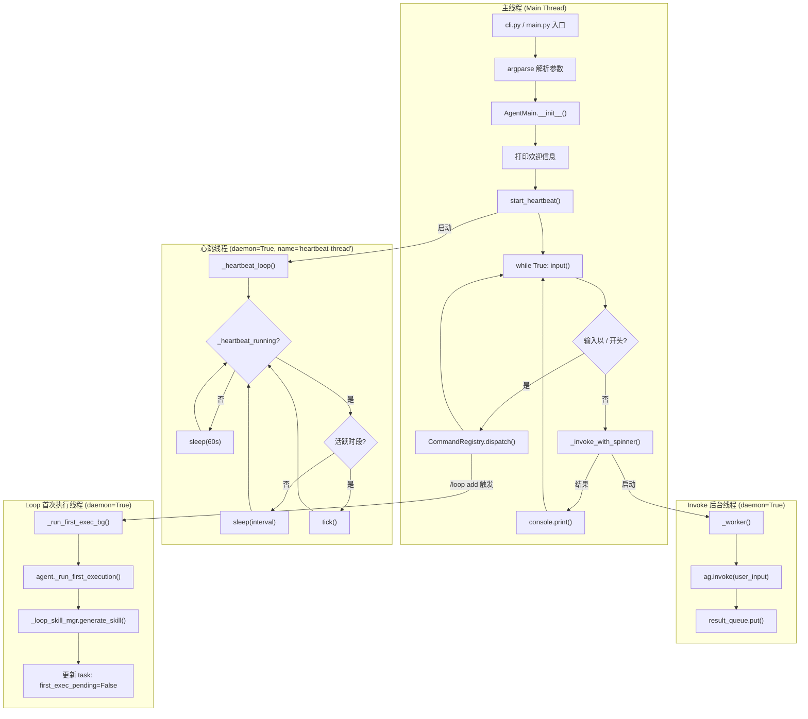
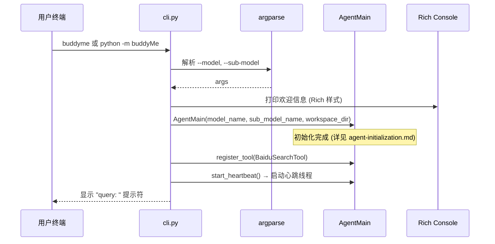
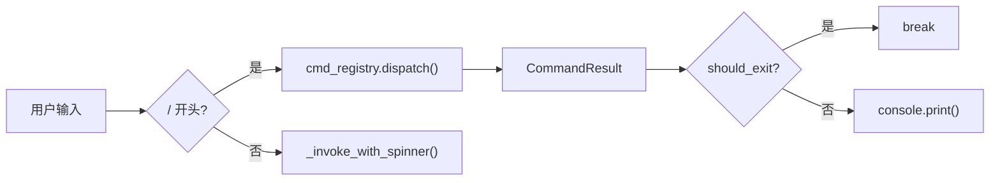
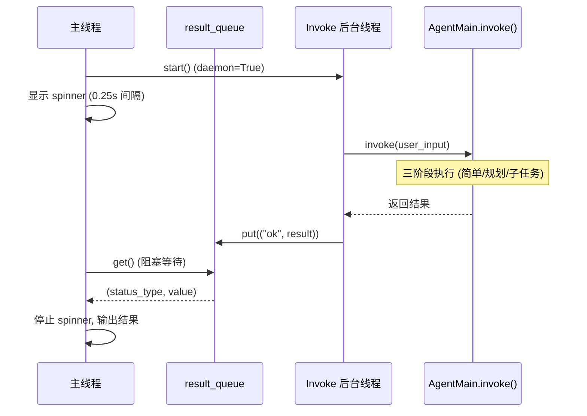
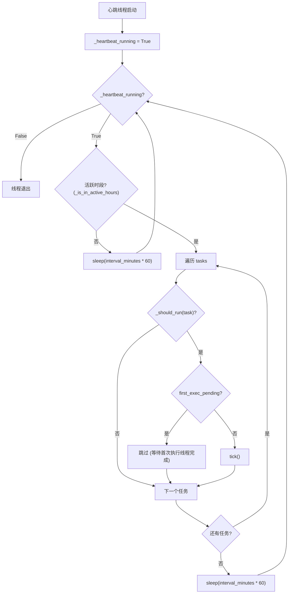
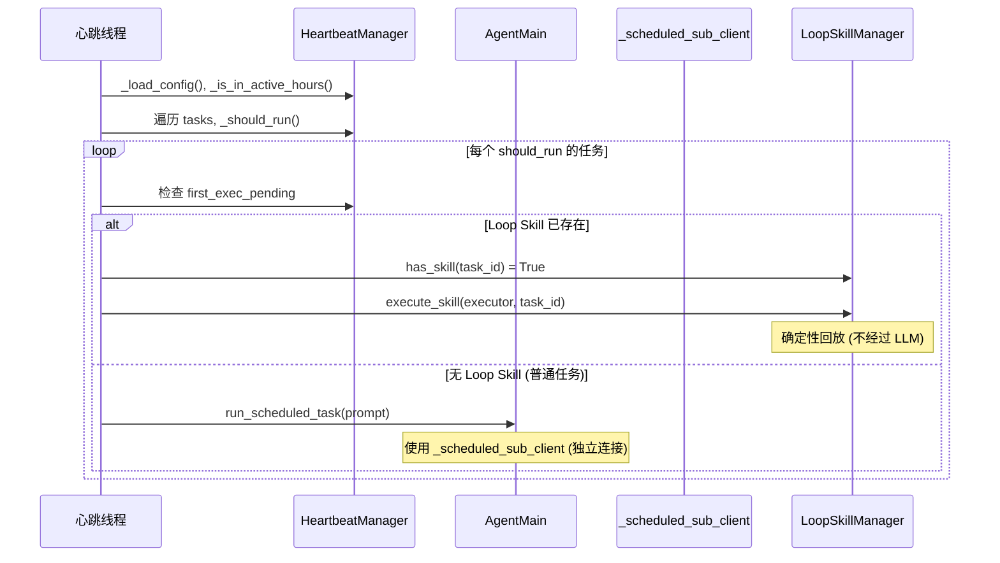
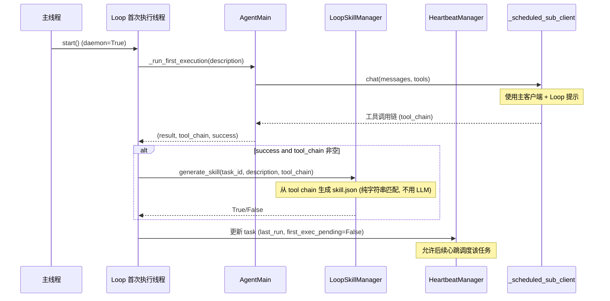
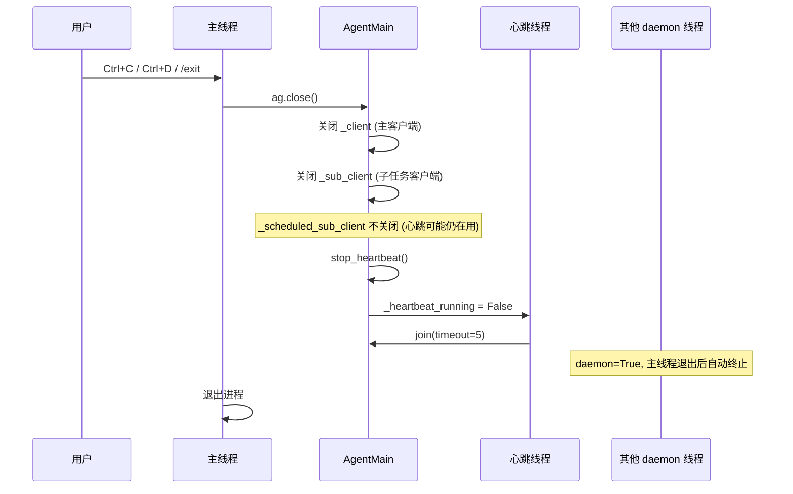

# CLI 入口线程架构详解

本文档详细梳理 `cli.py` 入口启动后的线程模型，包括主线程、invoke 后台线程、心跳线程、Loop Skill 首次执行线程的创建、协作和生命周期管理。

## 一、线程架构全景图



## 二、线程列表与属性

| 线程 | 创建位置 | daemon | 名称 | 生命周期 | 用途 |
|------|----------|--------|------|----------|------|
| **主线程** | Python 解释器 | 否 | `MainThread` | 进程存活期间 | 用户输入循环 + UI 展示 |
| **Invoke 后台线程** | `_invoke_with_spinner()` | 是 | — | 单次 invoke 完成即结束 | 异步执行 Agent 推理，避免阻塞 UI |
| **心跳线程** | `start_heartbeat()` | 是 | `heartbeat-thread` | `stop_heartbeat()` 调用后 join(5s) 退出 | 周期性执行定时任务 |
| **Loop 首次执行线程** | `_loop_add()` | 是 | — | 首次执行完成或超时(300s)后退出 | Loop 任务首次执行 + Skill 生成 |

## 三、主线程详解

### 3.1 启动流程



### 3.2 主循环

主线程的核心是一个 `while True` 循环，负责接收用户输入并分发处理：

```python
while True:
    try:
        inp = input("query: ")
        reply = _invoke_with_spinner(ag, inp)
        if reply:
            console.print(reply)
    except (KeyboardInterrupt, EOFError):
        console.print("\n再见!", style="bold yellow")
        ag.close()
        break
```

**关键机制**：
- `input()` 阻塞主线程，等待用户输入
- `KeyboardInterrupt` (Ctrl+C) 和 `EOFError` (Ctrl+D) 优雅退出
- `ag.close()` 关闭所有 LLM 客户端连接

### 3.3 命令拦截

用户输入以 `/` 开头时，在进入 LLM 之前被 `CommandRegistry` 拦截：



**注册的命令**：

| 命令 | 文件 | 功能 | 线程影响 |
|------|------|------|----------|
| `/help` | `system_cmds.py` | 显示帮助 | 无 |
| `/model` | `system_cmds.py` | 切换/查看模型 | 无 |
| `/exit` | `system_cmds.py` | 退出 | 设置 `should_exit=True` |
| `/memory` | `memory_cmds.py` | 记忆管理 | 无 |
| `/skill` | `skill_cmds.py` | 技能管理 | 无 |
| `/loop` | `loop_cmds.py` | 定时任务管理 | 可能启动 Loop 首次执行线程 |

## 四、Invoke 后台线程详解

### 4.1 创建时机

每次用户输入非命令内容时，`_invoke_with_spinner()` 创建一个后台线程来执行 `ag.invoke()`：

```python
def _invoke_with_spinner(ag: agent.AgentMain, user_input: str) -> str:
    result_queue: queue.Queue = queue.Queue(maxsize=1)

    def _worker():
        try:
            result_queue.put(("ok", ag.invoke(user_input)))
        except Exception as exc:
            result_queue.put(("err", exc))

    t = threading.Thread(target=_worker, daemon=True)
    t.start()
    # ... spinner 等待逻辑 ...
```

### 4.2 线程间通信



**通信机制**：
- **`queue.Queue(maxsize=1)`**：线程安全队列，容量为 1
- 主线程通过 `t.join(timeout=0.25)` 循环等待，同时更新 spinner
- 后台线程完成后将结果放入队列
- 主线程从队列获取结果并返回

### 4.3 Spinner 显示

主线程在等待 invoke 结果时，使用 Rich 的 `console.status()` 显示动态 spinner：

```python
idx = 0
with console.status("") as status:
    while t.is_alive():
        s = _SPINNERS[idx % len(_SPINNERS)]
        status.update(
            f"[bold cyan]{s} 思考中... "
            f"[dim](in: {ag._token_in} · out: {ag._token_out})[/]"
        )
        idx += 1
        t.join(timeout=0.25)
```

**显示内容**：
- 动态旋转字符（⠋⠙⠹⠸⠼⠴⠦⠧⠇⠏）
- "思考中..." 提示
- 实时 token 计数（输入/输出）

### 4.4 异常处理

```python
status_type, value = result_queue.get()
if status_type == "err":
    raise value  # 重新抛出异常
return value
```

## 五、心跳线程详解

### 5.1 创建与启动

```python
def start_heartbeat(self):
    def _heartbeat_loop():
        self._heartbeat_running = True
        while self._heartbeat_running:
            # ... 检查活跃时段、遍历任务、执行 ...
            for _ in range(60):
                if not self._heartbeat_running:
                    break
                time.sleep(1)

    self._heartbeat_thread = threading.Thread(
        target=_heartbeat_loop,
        daemon=True,
        name="heartbeat-thread"
    )
    self._heartbeat_thread.start()
```

### 5.2 线程执行流程



### 5.3 心跳执行入口 (tick)

`tick()` 方法是心跳线程执行定时任务的入口：



### 5.4 心跳客户端隔离

心跳任务使用 `_scheduled_sub_client`（而非主 `_client`），确保：

| 隔离维度 | 说明 |
|----------|------|
| **连接隔离** | 独立的 HTTP 连接池，不与主对话共享 |
| **上下文隔离** | 使用局部 messages，不写入 `self.messages` |
| **Prompt 隔离** | 使用精简 system prompt（仅 HEARTBEAT.md + 工具说明），不加载旅游顾问人格 |
| **Token 隔离** | 心跳消耗的 token 不计入主对话的 token 计数 |

### 5.5 停止心跳

```python
def stop_heartbeat(self):
    self._heartbeat_running = False
    if self._heartbeat_thread and self._heartbeat_thread.is_alive():
        self._heartbeat_thread.join(timeout=5)
```

设置标志位 → 等待线程结束（最多 5 秒） → 线程退出。

## 六、Loop 首次执行线程详解

### 6.1 创建时机

当用户通过 `/loop` 命令添加定时任务时，`_loop_add()` 在添加任务成功后立即启动一个后台线程执行首次执行：

```python
def _loop_add(ctx: CommandContext, args: str) -> CommandResult:
    # ... 解析参数, 添加任务到 HeartbeatManager ...
    
    bg_thread = threading.Thread(target=_run_first_exec_bg, daemon=True)
    bg_thread.start()
    
    return CommandResult(message=f"已添加定时任务: ...\n首次执行: 后台进行中...")
```

### 6.2 首次执行流程



### 6.3 线程安全操作

首次执行线程内部对 `HeartbeatManager` 的操作通过 `hb._lock`（可重入锁）保护：

```python
def _run_first_exec_bg():
    try:
        result, tool_chain, success = asyncio.run(_timed_exec())
        
        # 更新 last_run，清除 first_exec_pending — 线程安全
        with hb._lock:
            data = hb._load_config()
            for t in data.get("tasks", []):
                if t.get("id") == task_id:
                    t["last_run"] = datetime.now().isoformat()
                    t["first_exec_pending"] = False
                    break
            hb._save_config(data)
        
        # ... 生成 Loop Skill ...
    except asyncio.TimeoutError:
        # 超时也要清除 pending 标志
        with hb._lock:
            data = hb._load_config()
            for t in data.get("tasks", []):
                if t.get("id") == task_id:
                    t["first_exec_pending"] = False
                    break
            hb._save_config(data)
```

### 6.4 超时机制

```python
_FIRST_EXEC_TIMEOUT = 300  # 5 分钟

async def _timed_exec():
    return await asyncio.wait_for(
        ctx.agent._run_first_execution(description),
        timeout=_FIRST_EXEC_TIMEOUT,
    )
```

超时后同样清除 `first_exec_pending` 标志，允许后续心跳使用 LLM 降级执行该任务。

## 七、线程间协作与同步

### 7.1 线程同步机制一览

| 机制 | 使用位置 | 作用 |
|------|----------|------|
| `queue.Queue` | `_invoke_with_spinner` | 主线程与 Invoke 线程的结果传递 |
| `threading.RLock` | `HeartbeatManager._lock` | 保护 heartbeat.json 的读写 |
| `threading.Event` (标志位) | `_heartbeat_running` | 控制心跳线程的启停 |
| `daemon=True` | 所有后台线程 | 主线程退出时自动终止后台线程 |
| `first_exec_pending` 标志 | heartbeat.json 任务配置 | 防止心跳和首次执行同时运行同一任务 |

### 7.2 线程生命周期关系

```mermaid
flowchart TD
    MAIN["主线程"] -->|启动| INVOKE["Invoke 线程"]
    MAIN -->|start_heartbeat()| HEARTBEAT["心跳线程"]
    MAIN -->|/loop add| LOOP_FIRST["Loop 首次执行线程"]
    
    INVOKE -->|完成| JOIN1["线程结束"]
    HEARTBEAT -->|stop_heartbeat()| JOIN2["join(5s) 后结束"]
    LOOP_FIRST -->|完成/超时| JOIN3["线程结束"]
    
    MAIN -->|exit| CLOSE["ag.close()"]
    CLOSE -->|daemon| AUTO_KILL1["Invoke 线程自动终止"]
    CLOSE -->|daemon| AUTO_KILL2["心跳线程自动终止"]
    CLOSE -->|daemon| AUTO_KILL3["Loop 首次执行线程自动终止"]
```

### 7.3 并发场景分析

| 场景 | 涉及线程 | 同步机制 |
|------|----------|----------|
| 用户输入 → Agent 推理 | 主线程 + Invoke 线程 | `Queue` |
| 心跳定时触发 → 执行任务 | 心跳线程 | `_heartbeat_running` 标志 + `_lock` |
| `/loop add` → 首次执行 | 主线程 + Loop 首次执行线程 | `first_exec_pending` 标志 + `_lock` |
| 心跳 tick 遇到 `first_exec_pending=True` 的任务 | 心跳线程 | 跳过该任务 |
| Loop 首次执行完成 → 心跳可调度 | Loop 首次执行线程 → 心跳线程 | `first_exec_pending=False` + `_lock` |
| 用户 Ctrl+C → 退出 | 主线程 | `ag.close()` + daemon 自动清理 |

## 八、Agent 退出流程



**关闭顺序**：
1. 关闭主客户端 `_client` 和子任务客户端 `_sub_client`
2. **不关闭** `_scheduled_sub_client`（心跳线程可能还需要它）
3. 停止心跳线程（设标志位 + join 等待）
4. daemon 线程随主进程退出自动终止

## 九、线程安全注意事项

1. **heartbeat.json 并发写入**：`HeartbeatManager` 的所有写操作通过 `threading.RLock` 保护，确保心跳线程和 Loop 首次执行线程不会同时修改配置文件
2. **`self.messages` 访问**：仅在主线程的 `invoke()` 中修改，子任务和心跳使用局部 messages，不存在竞争
3. **`first_exec_pending` 竞态**：心跳线程在 tick 时检查此标志，Loop 首次执行线程完成后清除它；由于两者都通过 `_lock` 保护，不存在竞态条件
4. **客户端关闭顺序**：`invoke()` 完成后只关闭 `_client` 和 `_sub_client`，不关闭 `_scheduled_sub_client`，避免心跳线程使用已关闭的连接