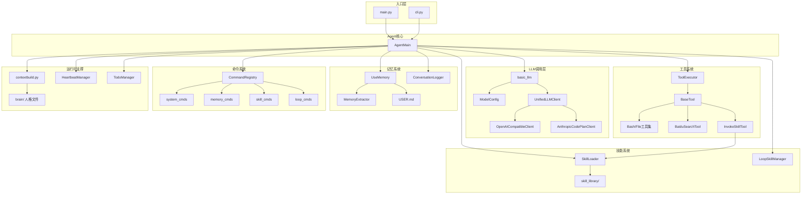

# 核心模块详解与模块间调用关系

本文档详细描述 buddyMe 各核心模块的职责、内部机制，以及模块间的调用关系。

## 一、核心模块详解

### 1. LLM 调用层（llm_moudle + anthropic_standard）

| 组件 | 职责 |
|------|------|
| `ModelConfig` | 管理所有模型的 API Key、Base URL、模型名、max_tokens |
| `basic_llm.create_client()` | 工厂函数，根据模型名创建 `UnifiedLLMClient` |
| `UnifiedLLMClient` | 自动检测协议（OpenAI/Anthropic），委托给对应实现 |
| `OpenAICompatibleClient` | OpenAI 兼容协议客户端 |
| `AnthropicCodePlanClient` | Anthropic 协议客户端（含格式双向转换） |

### 2. 工具系统（tool_moudle + basic_anthropic_tool）

- `BaseTool`：抽象基类，定义 name/description/parameters/execute
- `ToolExecutor`：工具注册表 + 执行器，管理所有已注册工具
- 内置工具：`BashTool`、`ReadFileTool`、`WriteFileTool`、`EditFileTool`、`GrepTool`、`GlobTool`、`BaiduSearchTool`、`InvokeSkillTool`

### 3. 技能系统（Skill System）

三层渐进式加载：
- **Level 1**：元数据注入 system prompt（name + description）
- **Level 2**：匹配后加载完整 SKILL.md 指令体
- **Level 3**：按需读取 scripts/references/assets 资源

### 4. 记忆系统

- `UseMemory`：用户记忆管理（提取→去重→评分→衰减→整合）
- `ConversationLogger`：对话记录持久化（JSON格式，按日期归档，支持轮转）
- `USER.md`：用户画像自进化文件

### 5. 命令系统（cmd_library）

以 `/` 前缀拦截用户输入，不经过 LLM，零 token 消耗。支持 `/help`、`/model`、`/memory`、`/skill`、`/loop` 等命令。

## 二、模块间调用关系图

## 三、模块职责速查表

| 模块 | 所在目录 | 核心职责 | 关键类/函数 |
|------|----------|----------|-------------|
| LLM调用层 | `llm_moudle/` + `anthropic_standard/` | 多模型统一调用 | `ModelConfig`, `UnifiedLLMClient`, `basic_llm.create_client()` |
| 工具系统 | `tool_moudle/` + `basic_anthropic_tool.py` | 工具注册与执行 | `BaseTool`, `ToolExecutor` |
| 技能系统 | `skill_library/` + `skill_loader.py` | 技能渐进式加载与匹配 | `SkillLoader`, `LoopSkillManager` |
| 记忆系统 | `use_memory.py` + `memory_extractor.py` | 用户记忆自进化 | `UseMemory`, `MemoryExtractor` |
| 命令系统 | `cmd_library/` | 零token命令拦截 | `CommandRegistry`, 各`*_cmds.py` |
| 运行时支撑 | `initspace/` | 人格/心跳/任务/上下文 | `ContextBuild`, `HeartbeatManager`, `TodoManager` |
