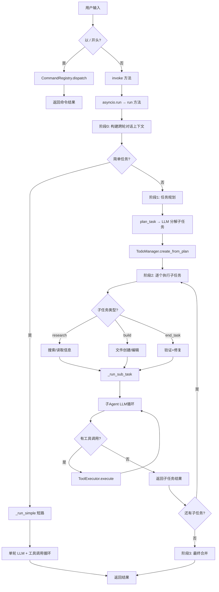
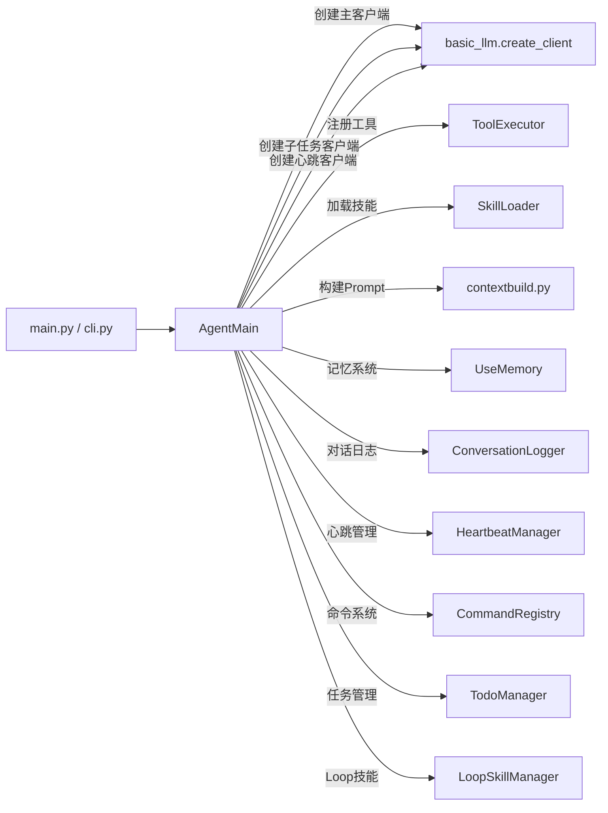
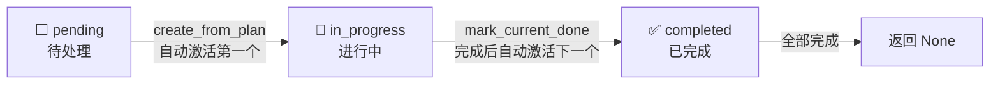
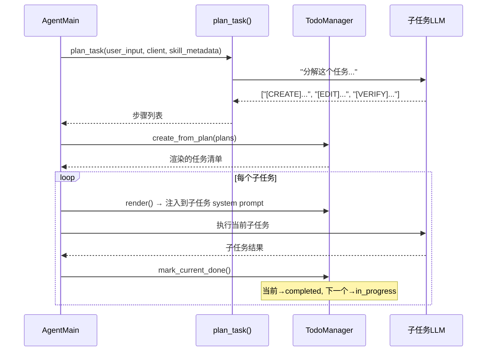

# 核心执行流程与Agent初始化

本文档描述 buddyMe Agent 从用户输入到最终输出的完整执行流程，以及 Agent 初始化时的调用关系。

## 一、核心执行流程



## 二、Agent 初始化详解

> 📄 详见 [Agent 初始化详解](agent-initialization.md)

### Agent 初始化调用关系概览



## 三、执行阶段详解

### 阶段 0：构建对话上下文 (`_build_conversation_context`)

每次 `invoke` 时调用，将历史对话、记忆摘要、当前输入组装为 LLM 可用的 messages：

```
层1: 摘要记忆（memory_summary.md）
  └─ 按日期归档的历史摘要
  └─ 去重策略：有工作记忆时跳过当天摘要（避免重复）
  └─ 硬上限：6000 字符

层2: 工作记忆（self.messages 最近 N 轮）
  └─ 滑动窗口：最近 3 轮 × 2（user+assistant）= 6 条消息
  └─ 长消息自动截断：>1000 字符时保留首 600 + 尾 400 字符
```

### 简单任务短路 (`_is_simple_task` + `_run_simple`)

纯规则判断（零 LLM 调用）：
- 包含"生成/创建/写/开发"等关键词 → 复杂任务
- 文本 < 40 字符且无复杂关键词 → 简单任务
- 文本 > 100 字符 → 复杂任务

简单任务直接走单轮 LLM + 工具调用，跳过规划-拆解-合并三阶段，节省延迟和 token。

### 阶段 1：任务规划 (`plan_task`)

复杂任务交给 LLM 分解为子任务列表，存入 `TodoManager`，同时创建 `subtask_results.json` 记录执行进度。

#### TodoManager 任务管理器详解

> 📄 源码：`buddyMe/initspace/todo_manager.py`

**核心特征**：TodoManager 是智能体内部任务管理器，**对大语言模型不可见，不对外暴露为工具**。它是纯 Python 内部状态管理，LLM 看不到它，只能看到它 `render()` 出来的文本。

**组成结构**：

| 组件 | 类型 | 职责 |
|------|------|------|
| `plan_task()` | 模块级 async 函数 | 调用 LLM 分解任务，返回步骤列表 |
| `TodoManager` | 类 | 管理子任务生命周期与状态流转 |

#### `plan_task()` — 任务规划函数

单独调用一次 LLM，按文件操作粒度分解任务：

1. 构造 `plan_prompt`，要求 LLM 按文件操作粒度分解任务
2. 每个步骤用标签标注类型：`[SEARCH]`/`[CREATE]`/`[EDIT]`/`[VERIFY]`/`[SKILL:xxx]`
3. 最多 8 个步骤，简单任务不分解（直接返回原句）
4. LLM 调用失败时降级为 `[user_input]`（只含原任务）

**分解示例**：
```
用户: "帮我写一个 Python 脚本计算斐波那契数列"
输出:
  [CREATE] 创建斐波那契计算脚本文件，包含函数定义和基本结构
  [EDIT] 向脚本中补充用户输入和输出逻辑
  [VERIFY] 读取脚本文件，检查语法和逻辑正确性
```

#### `TodoManager` — 任务状态追踪器

管理子任务的生命周期，三种状态流转：



**核心方法**：

| 方法 | 作用 |
|------|------|
| `create_from_plan(plan)` | 接收步骤列表，初始化待办清单，自动将第一个设为 `in_progress` |
| `mark_current_done()` | 将当前 `in_progress` 标记为 `completed`，自动激活下一个 `pending` |
| `render()` | 渲染为带 Emoji 图标的可读文本，注入到 LLM 上下文中 |
| `is_empty()` | 检查是否还有待办任务 |
| `_get_in_progress()` | 内部方法，查找当前进行中的任务 |

**`render()` 输出示例**：
```markdown
## 当前任务计划
  🔄 [1] [CREATE] 创建斐波那契计算脚本文件 (in_progress)
  ⬜ [2] [EDIT] 向脚本中补充用户输入和输出逻辑 (pending)
  ⬜ [3] [VERIFY] 读取脚本文件，检查语法正确性 (pending)
  进度: 0/3
```

#### 在 Agent 中的调用时序



**Agent 中的关键代码位置**（`agent.py`）：

| 行号 | 调用 | 说明 |
|------|------|------|
| 188 | `TodoManager()` | 初始化任务管理器 |
| 842 | `plan_task(...)` | 调用 LLM 分解任务 |
| 847 | `create_from_plan(plans)` | 创建待办清单 |
| 864-866 | 遍历 `items` | 逐个执行子任务 |
| 1081 | `mark_current_done()` | 子任务完成后更新状态 |

#### 设计要点

| 特性 | 说明 |
|------|------|
| **LLM 不可见** | 不作为工具暴露给 LLM，纯内部状态管理 |
| **标签分类** | 子任务带 `[SEARCH]`/`[CREATE]`/`[EDIT]`/`[VERIFY]` 标签，Agent 据此分配不同工具集 |
| **技能对齐** | 分解时参考已有 Skill，匹配到的步骤用 `[SKILL:技能名]` 标注 |
| **自动流转** | `mark_current_done()` 自动完成→激活下一个，无需手动管理 |
| **进度可视化** | `render()` 输出带 Emoji 的进度条，注入 LLM 上下文使其"感知"整体进度 |
| **降级保护** | LLM 规划失败时降级为单任务 `[user_input]`，不阻断流程 |

### 阶段 2：子任务执行 (`_run_sub_task`)

每个子任务使用**独立的局部 `task_messages`**，不追加到 `self.messages`。子任务类型分类：
- **research**：搜索/读取信息（工具集受限）
- **build**：文件创建/编辑（完整工具集）
- **end_task/verify**：读取+验证+修复（read_file + edit_file）

### 阶段 3：最终合并

所有子任务完成后，将各子任务结果汇总，由主 Agent LLM 生成最终输出。

## 四、关键执行机制

### 子任务隔离机制

| 客户端 | 用途 | 模型 | 独立性 |
|--------|------|------|--------|
| `_client` | 主对话（用户交互） | `model_name` | 与其他两个完全独立 |
| `_sub_client` | 子任务执行 | `sub_model_name` | 独立 messages，不污染主对话 |
| `_scheduled_sub_client` | 心跳定时任务 | `sub_model_name` | 独立连接，不阻塞用户交互 |

### 工具结果压缩 (`_compress_tool_results`)

当 `task_messages` 超过 `max_messages_length` 时触发：
1. 按工具名标注每条结果
2. 单条过长结果保留首 2/3 + 尾 1/3
3. 总长超限时优先保留最近的结果，丢弃早期的
4. 保底：至少保留最后一条结果

### 搜索调用限流

- `_MAX_SEARCH_CALLS`：每个子任务最多调用搜索的次数
- 超限后：压缩消息 → 下次 LLM 调用不带 tools → 强制直接输出结果
- 目的：防止 LLM 陷入无限搜索循环

### 截断续写机制

当 `stop_reason` 为 `max_tokens` 或 `length` 时：
- **已调用过 write_file** → 引导用 `edit_file` 补充剩余内容
- **未调用过 write_file** → 允许一次续写，然后引导用 `write_file` 创建文件
- **子任务内**：允许最多 3 次续写，之后强制结束

### 技能预匹配 (`SkillLoader.get_matched_instructions`)

子任务执行前尝试匹配最相关的 Skill：
- **匹配成功** → 注入完整 SKILL.md 指令体，LLM 直接按指令执行
- **未匹配但有元数据** → 注入规则 + 技能列表，引导 LLM 自行判断
- **完全无匹配** → 不注入任何技能信息
