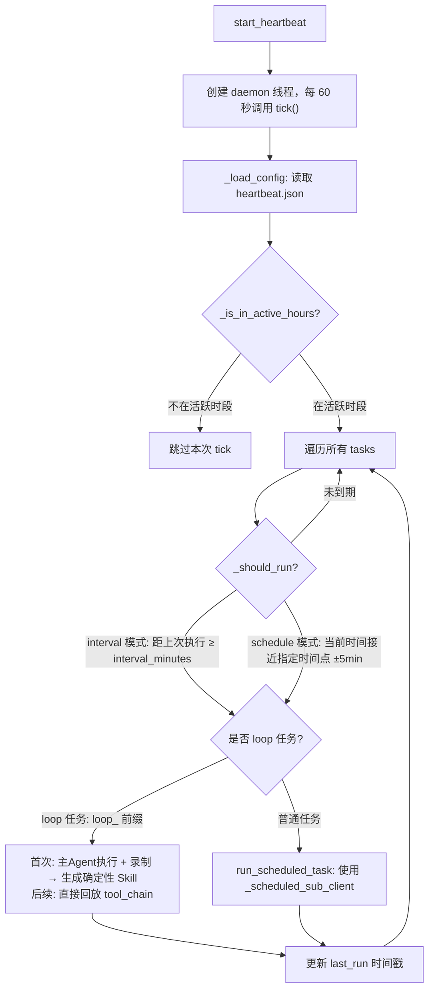

# 心跳定时任务详解

本文档详细描述 buddyMe Agent 心跳定时任务系统的设计、工作机制和用户交互方式。

## 一、主要用途

1. **记忆自动更新** — 定期读取对话记录，提取用户画像、偏好和需求变化，自动更新记忆摘要文件
2. **用户自定义定时任务** — 用户可以通过 `/loop` 命令添加任意定时任务（如定时抓取数据、生成报告等）

## 二、工作机制

整个心跳系统分为两层：

| 层级 | 组件 | 职责 |
|------|------|------|
| **数据层** | `HeartbeatManager` | 管理 `heartbeat.json` 配置读写、判断活跃时段、判断任务是否到期 |
| **执行层** | `Agent.tick()` + `start_heartbeat()` | 后台线程每 60 秒轮询一次，调用 `tick()` 遍历任务并执行 |

## 三、执行流程



## 四、关键设计特点

- **线程隔离**：心跳任务使用独立的 messages 和精简的 system prompt（仅 HEARTBEAT.md），不影响主对话上下文
- **两种调度模式**：
  - `interval_minutes`：间隔触发（如每 30 分钟执行一次）
  - `schedule`：定时触发（如每天 08:00 执行）
- **活跃时段控制**：可配置 `active_hours`，避免深夜执行
- **超时保护**：每个任务有独立超时时间（默认 300 秒）
- **两类任务**：
  - **内置心跳任务**：记忆更新等，可调用 `invoke_skill`
  - **Loop 任务**（ID 以 `loop_` 开头）：用户自定义的定时任务，使用更精简的工具集

## 五、Loop Skill 确定性回放

首次执行时用主 Agent 完整执行并录制工具调用链（tool_chain），生成确定性 Skill；后续 tick 直接回放 tool_chain，不经过 LLM，保证结果一致且零延迟。

## 六、用户交互方式

```bash
/heartbeat start          # 启动心跳系统
/heartbeat stop           # 停止心跳系统
/heartbeat --enable <id>  # 启用某个任务
/heartbeat --disable <id> # 禁用某个任务

/loop 30m 每半小时检查一次天气  # 添加自定义定时任务
/loop --list                    # 查看所有定时任务
/loop --remove <id>             # 删除任务
```

简单来说，心跳定时任务让 Agent 从"被动应答"升级为"主动执行"，具备了类似 cron 的后台自动化能力。
