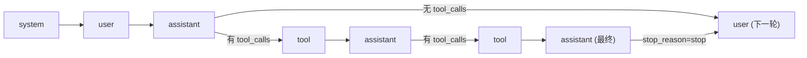
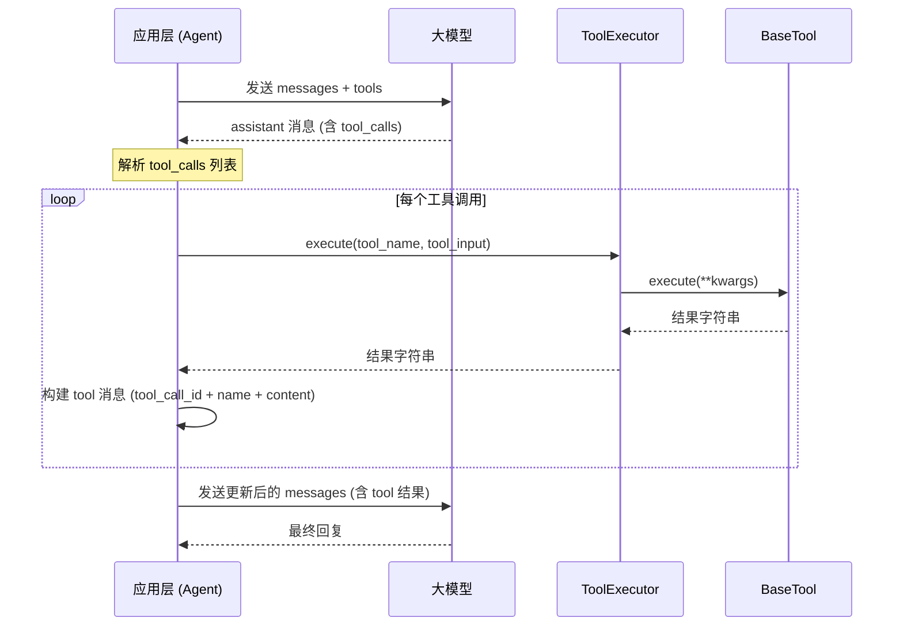
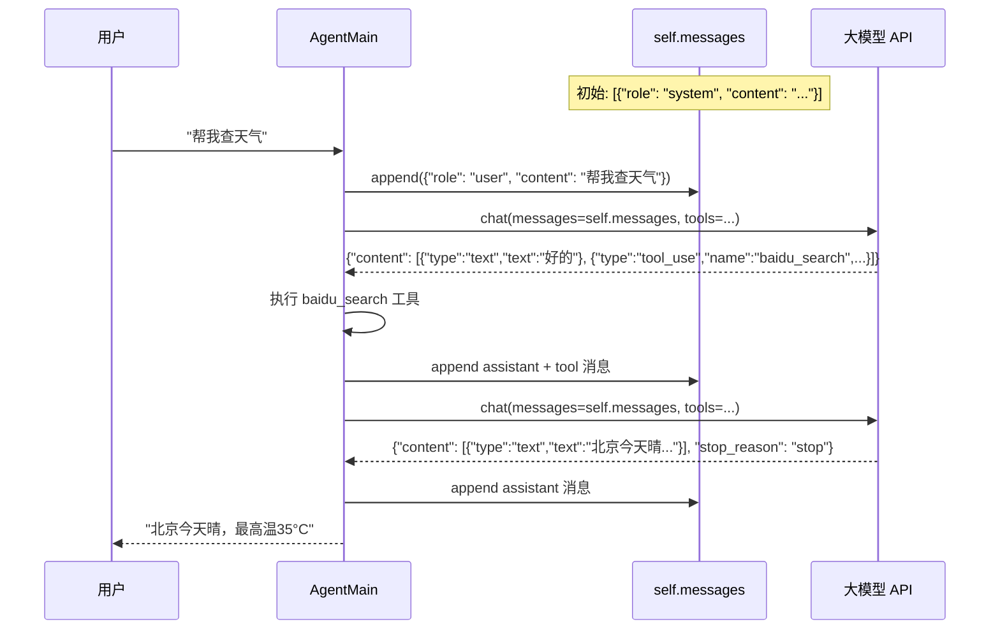
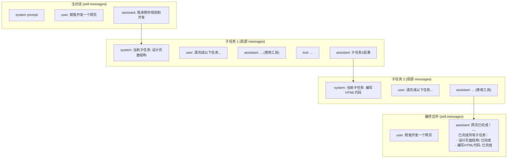
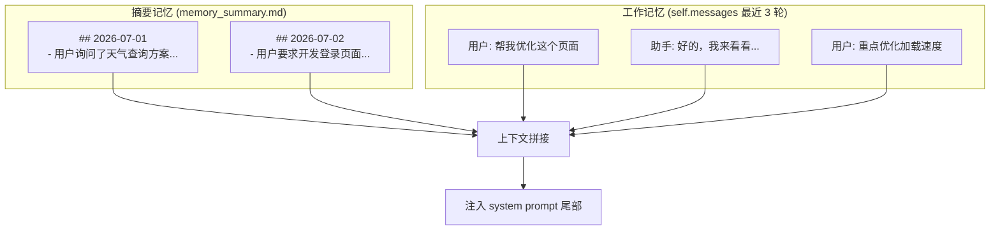
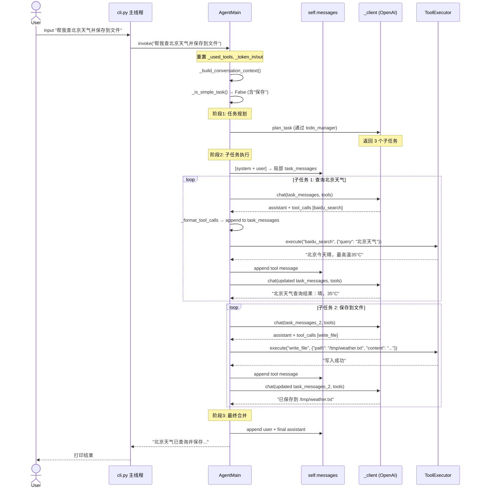

# OpenAI Chat Completions API 协议详解

本文档详细描述项目中所使用的 OpenAI Chat Completions API 协议，包括请求参数、消息格式、工具调用规范、响应结构，以及在多轮对话中如何关联消息和传递历史信息。

---

## 一、协议概述

本项目通过 `UnifiedLLMClient` 自动适配两种协议：

| 协议 | 判定条件 | 端点 | 客户端实现 |
|------|----------|------|-----------|
| **OpenAI** | `base_url` 不含 "anthropic" | `POST {base_url}` | `OpenAICompatibleClient` |
| **Anthropic** | `base_url` 含 "anthropic" 或 `model_name` 以 `_code_plan` 结尾 | `POST {base_url}/v1/messages` | `AnthropicCodePlanClient` |

协议判定逻辑（`unified_client.py`）：

```python
def _is_anthropic_protocol(model_name: str) -> bool:
    cfg = model_config.ModelConfig.get(model_name)
    base_url = cfg.get("base_url", "")
    return model_name.endswith("_code_plan") or "anthropic" in base_url.lower()
```

---

## 二、OpenAI 协议 — 请求参数

### 2.1 请求 URL

```
POST {base_url}
```

- `base_url` 从 `model_config.py` 中获取，例如：
  - GLM: `https://open.bigmodel.cn/api/paas/v4/chat/completions`
  - DeepSeek: `https://api.deepseek.com/chat/completions`
  - ERNIE: `https://qianfan.baidubce.com/v2/chat/completions`
  - Qwen: `https://dashscope.aliyuncs.com/compatible-mode/v1/chat/completions`

### 2.2 请求头

```http
Authorization: Bearer {api_key}
Content-Type: application/json
```

- `api_key` 从 `model_config.py` 中对应模型的环境变量获取，例如 `GLM_API_KEY`、`DEEPSEEK_API_KEY`。

### 2.3 请求体 (Request Body)

```json
{
  "model": "glm-5.1",              // 必需：模型名称（api_model，非 model_name）
  "messages": [...],                 // 必需：消息列表（详见第三节）
  "temperature": 0.0,               // 可选：采样温度 [0, 2]
  "max_tokens": 131072,             // 可选：最大生成 token 数
  "tools": [...],                    // 可选：工具定义列表（详见第四节）
  "tool_choice": "auto"             // 可选：工具选择策略
}
```

#### 参数详解

| 参数 | 类型 | 必需 | 默认值 | 说明 |
|------|------|------|--------|------|
| `model` | string | 是 | — | API 端真实模型名（`api_model`），如 `glm-5.1`、`deepseek-v4-pro` |
| `messages` | array | 是 | — | 对话消息列表，详见第三节 |
| `temperature` | float | 否 | 0.0 | 采样温度。0 = 确定性输出，1 = 最大随机性 |
| `max_tokens` | int | 否 | 81920/131072 | 最大生成 token 数，各模型默认值不同 |
| `tools` | array | 否 | null | 工具定义列表，详见第四节 |
| `tool_choice` | string/object | 否 | "auto" | 工具选择策略："auto"=自动, "none"=禁用, {"type":"function","function":{"name":"xxx"}}=指定 |
| `thinking` | object | 否 | — | 思考模式控制。`{"type": "disabled"}` 禁用思考模式（用于 DeepSeek） |

---

## 三、消息格式 (Messages)

### 3.1 消息角色 (Roles)

OpenAI 协议支持 4 种消息角色：

| 角色 | 作用 | 发送方 | 格式示例 |
|------|------|--------|---------|
| `system` | 设定助手行为、人格、上下文 | 应用层 | `{"role": "system", "content": "你是一个旅游助手..."}` |
| `user` | 用户输入 / 工具执行结果 | 应用层/系统 | `{"role": "user", "content": "帮我查北京天气"}` |
| `assistant` | 模型回复（含文本和/或工具调用） | 模型 | `{"role": "assistant", "content": "好的，让我查一下...", "tool_calls": [...]}` |
| `tool` | 工具执行结果回传 | 应用层 | `{"role": "tool", "tool_call_id": "call_abc", "name": "bash", "content": "输出结果"}` |

### 3.2 消息顺序规则



**核心规则**：
1. `system` 消息通常位于对话开头
2. `user` 和 `assistant` 严格交替出现
3. 当 `assistant` 包含 `tool_calls` 时，后续必须跟对应的 `tool` 消息
4. 每条 `tool` 消息的 `tool_call_id` 必须与 `assistant.tool_calls` 中的 `id` 一一对应

### 3.3 消息格式转换 (`convert_to_sdk_format`)

项目中的 `convert_to_sdk_format` 函数对原始消息做以下处理：

| 步骤 | 操作 | 说明 |
|------|------|------|
| 1 | 收集 system 消息 | 所有 `role=system` 的消息暂存，统一放到对话开头 |
| 2 | 标准化 assistant 的 tool_calls | 保留 `tool_calls` 字段，`content` 为空时设为 `None`（OpenAI 规范） |
| 3 | 过滤空消息 | 跳过 `content` 为空的无效消息 |
| 4 | 兜底处理 | 剩余未处理的 system 消息追加到结果末尾 |

---

## 四、工具调用 (Tool Calling)

### 4.1 工具定义格式

```json
{
  "type": "function",
  "function": {
    "name": "bash",
    "description": "执行 bash 命令并返回标准输出",
    "parameters": {
      "type": "object",
      "properties": {
        "command": {
          "type": "string",
          "description": "要执行的 bash 命令"
        }
      },
      "required": ["command"]
    }
  }
}
```

**字段说明**：
- `name`: 工具名称，全局唯一标识
- `description`: 工具描述，供大模型理解何时调用此工具
- `parameters`: JSON Schema 格式的参数定义，定义工具接受的输入

### 4.2 项目中注册的工具

| 工具名 | 类 | 功能 |
|--------|-----|------|
| `bash` | `BashTool` | 执行 shell 命令 |
| `read_file` | `ReadFileTool` | 读取文件内容 |
| `write_file` | `WriteFileTool` | 写入文件 |
| `edit_file` | `EditFileTool` | 编辑文件（查找替换） |
| `grep` | `GrepTool` | 正则搜索文件内容 |
| `glob` | `GlobTool` | 按文件名模式搜索 |
| `baidu_search` | `BaiduSearchTool` | 百度搜索 |
| `invoke_skill` | `InvokeSkillTool` | 激活技能 |

### 4.3 工具调用流程



### 4.4 assistant 消息中的工具调用

当模型决定调用工具时，`assistant` 消息格式为：

```json
{
  "role": "assistant",
  "content": null,
  "tool_calls": [
    {
      "id": "call_abc123",
      "type": "function",
      "function": {
        "name": "bash",
        "arguments": "{\"command\": \"date '+%Y-%m-%d %H:%M:%S'\"}"
      }
    },
    {
      "id": "call_def456",
      "type": "function",
      "function": {
        "name": "write_file",
        "arguments": "{\"path\": \"/tmp/test.txt\", \"content\": \"Hello\"}"
      }
    }
  ]
}
```

**关键点**：
- `content` 为 `null`（模型只调用工具，不生成文本）
- `tool_calls` 是数组，可包含多个工具调用
- `id` 是本次工具调用的唯一标识，用于后续 `tool` 消息匹配
- `arguments` 是 **JSON 字符串**（不是对象），需要 `json.loads()` 解析

### 4.5 tool 消息格式（结果回传）

```json
{
  "role": "tool",
  "tool_call_id": "call_abc123",
  "name": "bash",
  "content": "2026-07-03 13:23:11"
}
```

**关键点**：
- `tool_call_id` 必须与 `assistant.tool_calls[].id` 精确匹配
- `name` 必须与对应的工具调用名称匹配
- `content` 是工具执行结果的字符串表示

### 4.6 `_format_tool_calls` — Anthropic → OpenAI 格式转换

项目中使用 `_format_tool_calls` 将 Anthropic 格式的 `tool_use` 块转换为 OpenAI 兼容格式：

```python
@staticmethod
def _format_tool_calls(tool_calls: list) -> dict:
    """将 Anthropic 格式的 tool_use 块转换为 OpenAI 兼容的 assistant 消息"""
    return {
        "role": "assistant",
        "content": None,
        "tool_calls": [
            {
                "id": tc["id"],
                "type": "function",
                "function": {
                    "name": tc["name"],
                    "arguments": json.dumps(tc.get("input", {}), ensure_ascii=False)
                }
            }
            for tc in tool_calls
        ]
    }
```

**Anthropic 格式 vs OpenAI 格式对照**：

| 维度 | Anthropic 格式 | OpenAI 格式 |
|------|---------------|-------------|
| 消息中的字段名 | `content` 数组中的 `tool_use` 块 | `tool_calls` 数组 |
| 工具调用 ID | `tc["id"]` | `tc["id"]`（相同） |
| 工具名 | `tc["name"]` | `tc["name"]`（相同） |
| 工具参数 | `tc["input"]` (dict) | `tc["function"]["arguments"]` (JSON 字符串) |
| 工具结果回传格式 | `tool_result` 块嵌入 `user` 消息 | 独立 `tool` 角色消息 |
| 工具结果 ID 字段 | `tool_use_id` | `tool_call_id` |

---

## 五、响应格式

### 5.1 OpenAI 标准响应

```json
{
  "id": "chatcmpl-abc123",
  "object": "chat.completion",
  "model": "glm-5.1",
  "choices": [
    {
      "index": 0,
      "message": {
        "role": "assistant",
        "content": "北京今天晴，最高温35°C",
        "tool_calls": null
      },
      "finish_reason": "stop"
    }
  ],
  "usage": {
    "prompt_tokens": 150,
    "completion_tokens": 20,
    "total_tokens": 170
  }
}
```

### 5.2 项目内部标准化响应格式

项目将 OpenAI/Anthropic 的原始响应统一解析为以下格式：

```json
{
  "content": [
    {"type": "text", "text": "北京今天晴，最高温35°C"},
    {"type": "tool_use", "id": "call_abc123", "name": "bash", "input": {"command": "date"}}
  ],
  "stop_reason": "stop",
  "usage": {
    "prompt_tokens": 150,
    "completion_tokens": 20
  }
}
```

**`_parse_response` 解析逻辑**（`OpenAICompatibleClient`）：

| OpenAI 原始字段 | 标准化字段 | 转换规则 |
|-----------------|-----------|---------|
| `choices[0].message.content` | `content[].text` | 文本内容 → `{"type": "text", "text": ...}` |
| `choices[0].message.tool_calls` | `content[].tool_use` | 每个工具调用 → `{"type": "tool_use", "id": ..., "name": ..., "input": ...}` |
| `choices[0].finish_reason` | `stop_reason` | `"tool_calls"` → `"tool_use"`，其他保持原值 |
| `usage.prompt_tokens` | `usage.prompt_tokens` | 直接映射 |
| `usage.completion_tokens` | `usage.completion_tokens` | 直接映射 |

**`_parse_response` 解析逻辑**（`AnthropicCodePlanClient`）：

| Anthropic 原始字段 | 标准化字段 | 转换规则 |
|-------------------|-----------|---------|
| `content` 数组 | `content` | 直接映射（已是标准格式） |
| `stop_reason` = `"end_turn"` | `stop_reason` = `"stop"` | 名称映射 |
| `usage.input_tokens` | `usage.prompt_tokens` | 字段名映射 |
| `usage.output_tokens` | `usage.completion_tokens` | 字段名映射 |

---

## 六、多轮对话的消息关联与历史传递

### 6.1 消息关联机制

多轮对话通过 **完整的消息列表** (`self.messages`) 来维持上下文关联。每一轮对话，应用层都会将当前轮的 `user`、`assistant`、`tool` 消息追加到 `self.messages` 中，下次请求时将完整列表发送给模型。



### 6.2 消息持久化 — `add_message` 与滑动窗口

```python
def add_message(self, role: str, content: str):
    """添加消息到历史"""
    if len(self.messages) >= self.max_messages_length:
        # 保留 system prompt (index 0) + 最新 N-1 条
        self.messages = [self.messages[0]] + self.messages[-(self.max_messages_length - 1):]
    self.messages.append({"role": role, "content": content})
```

**关键机制**：
- `self.messages` 是一个列表，以 `{"role": ..., "content": ...}` 格式存储
- 超过 `max_messages_length`（默认 20）时，保留第一条（system prompt）+ 最近 N-1 条
- 每轮 `invoke()` 调用前，`self.messages` 被重置（`_used_tools = []`, `_token_in/out = 0`），但消息历史保留
- `invoke()` 结束后，`self.add_message("user", user_input)` 和 `self.add_message("assistant", result)` 将本轮对话追加到历史

### 6.3 多轮对话中的工具调用关联

工具调用跨越多轮时，消息关联通过 `tool_call_id` 精确匹配：

```
Round 1:
  user: "帮我查天气"
  assistant: [tool_call: id="call_1", name="baidu_search", args={"query": "北京天气"}]
  tool: [tool_call_id="call_1", name="baidu_search", content="北京今天晴..."]

Round 2:
  assistant: "北京今天晴天，最高温35°C"
```

**规则**：
1. `tool` 消息的 `tool_call_id` 必须与 `assistant` 的 `tool_calls[].id` 匹配
2. 多个工具调用的结果按顺序追加 `tool` 消息
3. 所有 `tool` 消息追加完毕后，才发送给模型进行下一轮推理

### 6.4 三阶段执行中的消息隔离

项目采用三阶段架构执行复杂任务，每个子任务使用**独立的消息上下文**，不累积到 `self.messages`：



**隔离规则**：
- 每个子任务使用局部 `task_messages`，不影响 `self.messages`
- 子任务结果通过 `sub_results` 收集
- 最终合并时，只有最终结果被写入 `self.messages`

### 6.5 心跳任务的消息隔离

心跳任务同样使用独立的消息上下文和独立的客户端：

| 维度 | 主对话 | 心跳任务 |
|------|--------|----------|
| 客户端 | `self._client` | `self._scheduled_sub_client` |
| 消息列表 | `self.messages` | 局部 `messages` |
| System Prompt | 旅游顾问人格 + 完整提示 | 精简提示（仅 HEARTBEAT.md + 工具说明） |
| 写入 `self.messages` | ✅ | ❌ |
| Token 计数 | 计入 `_token_in/out` | 独立计数，不计入主对话 |

### 6.6 跨轮对话上下文构建

```python
def _build_conversation_context(self) -> str:
    """
    构建跨轮对话上下文（两层记忆）：
      1. 摘要记忆：从 memory_summary.md 提取历史摘要
      2. 工作记忆：self.messages 中最近 N 轮的原文
    """
```



**去重策略**：当工作记忆有内容时，摘要只注入当天之前的记录，避免当天对话在两层中重复出现。

### 6.7 对话日志记录

每轮 `invoke()` 结束后，`conv_logger.log()` 记录以下信息：

```python
self.conv_logger.log(
    query=user_input,
    response=result,
    model=self.model_name,
    tool_calls=self._used_tools,
    extra={
        "execute_cost_time": cost,
        "tool_call_count": len(self._used_tools),
        "used_skills": self._used_skills,
        "subtask_count": len(self._last_episode),
        "episode": self._last_episode,
    }
)
```

---

## 七、错误处理与重试机制

### 7.1 指数退避重试

两种客户端实现都采用相同的重试策略：

```python
_BASE_RETRY_DELAY = 5    # 基础延迟（秒）
_MAX_RETRY_DELAY = 120   # 延迟上限（秒）
max_retries = 5          # 最大重试次数
```

**可重试的 HTTP 状态码**：`429`（限速）、`500`、`502`、`503`、`529`（过载）

**重试延迟计算**：
```python
delay = min(_BASE_RETRY_DELAY * (2 ** attempt), _MAX_RETRY_DELAY)
jitter = delay * random.uniform(0.75, 1.25)
await asyncio.sleep(jitter)
```

### 7.2 连接错误处理

遇到 `httpx.ConnectError` 时：
1. 关闭旧客户端（`self._client = None`）
2. 创建新客户端（`await self._get_client()`）
3. 加入抖动延迟后重试

### 7.3 工具参数解析失败

当模型返回的 `arguments` JSON 解析失败时，调用 `_try_repair_arguments` 尝试修复：
1. 找到最后一个完整的 JSON 键值对
2. 补全缺失的闭合括号 `]` 和 `}`
3. 尝试 `json.loads()`，成功则返回修复结果
4. 所有修复方案都失败则返回空字典 `{}`

---

## 八、模型配置参数详解

### 8.1 model_config.py 配置映射

| 配置键 (model_name) | api_model | api_key 环境变量 | base_url | max_tokens |
|---------------------|-----------|-----------------|----------|------------|
| `glm` | `glm-5.1` | `GLM_API_KEY` | `https://open.bigmodel.cn/api/paas/v4/chat/completions` | 131072 |
| `glm_code_plan` | `glm-5.1` | `GLM_API_KEY` | `https://open.bigmodel.cn/api/anthropic` | 131072 |
| `sub_agent_code_plan` | `glm-5.1` | `GLM_API_KEY` | `https://open.bigmodel.cn/api/anthropic` | 131072 |
| `deepseek` | `deepseek-v4-pro` | `DEEPSEEK_API_KEY` | `https://api.deepseek.com/chat/completions` | 393216 |
| `deepseek_flash` | `deepseek-v4-flash` | `DEEPSEEK_API_KEY` | `https://api.deepseek.com/chat/completions` | 393216 |
| `deepseek_code_plan` | `deepseek-v4-pro` | `DEEPSEEK_API_KEY` | `https://api.deepseek.com/anthropic` | 960000 |
| `ernie` | `ernie-5.1` | `ERNIE_API_KEY` | `https://qianfan.baidubce.com/v2/chat/completions` | 65536 |
| `xiaomi` | `mimo-v2-pro` | `XIAOMI_API_KEY` | `https://api.xiaomimimo.com/v1/chat/completions` | 131072 |
| `qwen` | `qwen3.6-plus` | `QWEN_API_KEY` | `https://dashscope.aliyuncs.com/compatible-mode/v1/chat/completions` | 65536 |

### 8.2 模型特殊参数 (model_overrides)

通过 `UnifiedLLMClient` 的 `model_overrides` 注入：

| 参数 | 适用模型 | 作用 | 注入方式 |
|------|---------|------|---------|
| `thinking_disabled` | DeepSeek 系列 | 禁用思考模式 | `kwargs.setdefault("thinking_disabled", True)` → payload 中 `"thinking": {"type": "disabled"}` |
| `tool_choice` | ERNIE | 开启自动工具选择 | `kwargs.setdefault("tool_choice", "auto")` |
| `max_tokens` | 全部 | 覆盖默认 token 上限 | 直接覆盖 `effective_mt` |

### 8.3 客户端连接池配置

```python
timeout = httpx.Timeout(
    connect=30.0,            # 连接超时
    read=1080.0,             # 读取超时（OpenAI）/ 1800.0（Anthropic）
    write=30.0,              # 写入超时 / 360.0（Anthropic）
    pool=1080.0              # 连接池超时 / 1800.0（Anthropic）
)

limits = httpx.Limits(
    max_connections=3,             # 最大连接数
    max_keepalive_connections=2,   # 最大保活连接数
    keepalive_expiry=30.0          # 连接保活时间
)
```

---

## 九、Anthropic 协议差异对照

### 9.1 请求差异

| 维度 | OpenAI 协议 | Anthropic 协议 |
|------|-------------|---------------|
| 端点 | `{base_url}` | `{base_url}/v1/messages` |
| 认证头 | `Authorization: Bearer {api_key}` | `x-api-key: {api_key}` |
| 额外头 | 无 | `anthropic-version: 2023-06-01` |
| system 消息 | `messages` 数组中的 `role=system` 项 | 独立的 `system` 字段 |
| 工具定义 | `tools` 数组，格式为 `{"type":"function","function":{...}}` | `tools` 数组，格式为 `{"name":"...","description":"...","input_schema":{...}}` |
| 工具选择 | `tool_choice`: "auto"/"none"/指定 | `tool_choice`: "auto"/{"type":"tool","name":"xxx"} |

### 9.2 响应差异

| 维度 | OpenAI 协议 | Anthropic 协议 |
|------|-------------|---------------|
| 响应包装 | `choices[0].message` | 直接 `content` 数组 + `stop_reason` |
| 停止原因 | `finish_reason`: "stop"/"tool_calls"/"length" | `stop_reason`: "end_turn"/"tool_use"/"max_tokens" |
| Token 使用 | `prompt_tokens` + `completion_tokens` | `input_tokens` + `output_tokens` |
| 文本内容 | `message.content` (string) | `content` 数组中 `type=text` 的块 |
| 工具调用 | `message.tool_calls` 数组 | `content` 数组中 `type=tool_use` 的块 |
| 工具结果 ID | `tool_call_id` | `tool_use_id` |

### 9.3 消息格式双向转换

项目中的 `_convert_messages` 和 `_convert_tools` 完成了 OpenAI ↔ Anthropic 格式的双向转换：

**OpenAI → Anthropic 消息转换**：

| OpenAI 格式 | Anthropic 格式 | 转换规则 |
|-------------|---------------|---------|
| `{"role": "system", "content": "xxx"}` | 提取到 `payload.system` 字段 | 不在 `messages` 中 |
| `{"role": "assistant", "tool_calls": [...]}` | `{"role": "assistant", "content": [text块, tool_use块...]}` | `tool_calls` → `content` 中的 `tool_use` 块 |
| `{"role": "tool", "tool_call_id": "x", "content": "y"}` | 合并到前一个 `user` 消息的 `content` 中作为 `tool_result` 块 | 多个连续 `tool` 消息合并为一个 `user` 消息 |

**Anthropic → OpenAI 响应转换**（`_parse_response`）：

直接将 Anthropic 的 `content` 数组映射为标准格式，`stop_reason` 做 `"end_turn"→"stop"` 转换。

---

## 十、完整多轮对话流程示例

以下是一个完整的多轮对话+工具调用流程：



---

## 附录 A：工具调用中的特殊处理

### A.1 截断处理

当 `stop_reason` 为 `max_tokens` 或 `length` 时：

| 场景 | 处理方式 |
|------|---------|
| 已有 `write_file`/`edit_file` 调用 | 引导用 `edit_file` 补充剩余内容 |
| 未写过文件 | 允许一次续写（仅追加文本），续写后若仍截断则总结 |

### A.2 搜索次数限制

每个子任务最多调用 `baidu_search` 工具 `_MAX_SEARCH_CALLS`（默认 5）次。超出后：
- 仅执行非搜索工具
- 若无非搜索工具，则强制总结

### A.3 乱码检测与清理

`_sanitize_result` 方法对子任务结果逐行检测乱码：
- 含 Unicode 替换字符 (U+FFFD) → 移除该行
- 乱码指示字符（日文假名、Latin-1 补充）占比超 20% → 移除该行
- 可选截断至指定长度

### A.4 工具结果压缩

`_compress_tool_results` 方法将过长的工具调用结果压缩：
1. 按工具名标注每条结果
2. 对单条过长结果保留首尾、省略中间（2/3 + 1/3）
3. 总长度超限时优先保留最近的结果

---

## 附录 B：CLI 入口与模型切换

### B.1 命令行参数

```bash
python -m buddyMe --model glm --sub-model deepseek
```

| 参数 | 短选项 | 说明 | 默认值 |
|------|--------|------|--------|
| `--model` | `-m` | 主模型名称 | 环境变量 `BUDDYME_MODEL` 或 `glm_code_plan` |
| `--sub-model` | `-s` | 子任务模型名称 | 环境变量 `BUDDYME_SUB_MODEL` 或 `glm_code_plan` |

**优先级**：命令行参数 > 环境变量 > 代码默认值

### B.2 运行时模型切换

```python
agent.switch_model("deepseek")
```

- 仅切换主客户端 (`self._client`)
- 子任务/心跳客户端保持不变
- 对话历史 (`self.messages`) 保持不变
- 更新 `_agent_max_token` 和 `_sub_agent_max_token`
- 通知所有已注册工具更新模型名